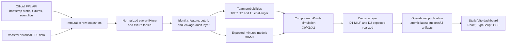

# FPL Forecast

FPL Forecast is an end-to-end, time-aware Fantasy Premier League forecasting and
decision system. It combines data engineering, statistical football modelling,
probabilistic FPL point simulation, backtesting, operational publication, and squad
optimization in one reproducible `uv` workspace.

Unofficial project. Not affiliated with, endorsed by, or associated with the Premier League or
Fantasy Premier League.

## Status
The first official-data 2026-27 GW1 forecast is published through the manually triggered,
clean-runner workflow. Launch verification covers the public artifacts and operational lineage, not
predictive superiority: live-season forecast performance has not yet been established, scheduling
is disabled, and clean-runner publication after GW1 remains blocked.

## What The System Does

- Archives immutable raw snapshots from official FPL endpoints and Vaastav historical files.
- Normalizes source data into player-fixture and fixture-grain Parquet tables with provenance.
- Builds stable cross-season team and player identities without trusting numeric IDs across seasons.
- Enforces source-availability lineage and leakage audits before model training.
- Evaluates baselines and model families with rolling-origin and Gameweek 1 backtests.
- Estimates team fixture probabilities, player minutes, component xPoints, and point distributions.
- Selects legal FPL squads, lineups, captaincy, vice-captaincy, and bench order with exact MILP
  baselines plus an expected-realized optimizer that accounts for ordinary automatic substitutions.
- Publishes validated frontend-ready artifacts atomically and preserves the last successful
  publication after failures.

## What Makes The Framework Different

### Time-Aware Lineage And Backtesting

Unlike approaches that train on retroactively aggregated season data, this framework treats
information availability as a first-class constraint. Historical match-derived features carry a
conservative `source_available_time`, normally `kickoff_time + 3 hours`, and are eligible only when
`source_available_time < information_cutoff`. The `+3h` rule is a conservative proxy when exact
completion or publication timestamps are unavailable; it reduces look-ahead inflation but is not a
mathematical guarantee against every possible leakage mode.

Rolling-origin and Gameweek 1 backtests reproduce the information that would reasonably have been
available before each forecast. Same gameweek/deadline-block results are excluded from training.

### Separation Of Team State And Player Expectation

The system separates team-level match expectations from player-level opportunity. Opponent-adjusted
Poisson models estimate fixture score distributions, clean-sheet probabilities, and outcome
probabilities. A Dixon-Coles low-score dependence model is retained as an experimental challenger
because audited backtests showed only marginal, mixed differences versus the independent Poisson
default. Separate expected-minutes models estimate appearance and role duration. The component
simulation combines team context, minutes, position, and player event rates into discrete FPL point
distributions.

### Closed-Loop Execution

This is an operational engine rather than a standalone notebook. A uniform `uv` workspace connects
versioned ingestion, normalization, identity resolution, data-quality validation, leakage audits,
rolling backtests, probabilistic forecasting, full-candidate MILP squad optimization, atomic
publication, failure recovery, and frontend-ready artifacts. The MILP layer uses SciPy's
HiGHS-backed solver and records solver status, objective bounds, gaps, runtimes, and diagnostics.

## Architecture



## Models And Decision System

Default model chain used by the current operational adapter:

- `T2_REGULARIZED_ATTACK_DEFENCE`: weighted ridge-penalized independent Poisson team model.
- `M7_HIERARCHICAL_AVAILABILITY_STATE`: explicit DNP, substitute, start-under-60, start-60-to-89,
  and start-90 state model used for official GW1 operation because it gives coherent GW1
  appearance/start/reached-60 probabilities.
- `X2_TEAM_CONSTRAINED_SIM_M7`: team-goal-constrained xPoints simulation using M7 minutes,
  hierarchical attacking-rate shrinkage, current-squad share allocation, and draw-level component
  reconciliation.
- `D2_EXPECTED_REALIZED_POINTS`: full-candidate D1 MILP seed plus deterministic one-swap
  expected-realized search. It scores ordinary automatic substitutions, bench order, goalkeeper-only
  goalkeeper replacement, captain non-appearance, and vice-captain fallback from M7 appearance
  probabilities by enumerating all 32,768 squad appearance states under an explicit independence
  assumption. The evaluator is exact under that assumption; D2 remains a bounded heuristic search,
  not a global optimizer proof.

Experimental challengers:

- `T3_DIXON_COLES`: low-score dependence correction, retained for research but not promoted over T2.
- `M5_REGULARIZED_STATE_SOFTMAX` and `M6_NONLINEAR_RECENCY_ENSEMBLE`: learned minutes/state
  challengers. M5 remains competitive and is retained as the main operational challenger.
- `X2_TEAM_CONSTRAINED_SIM_M5`: xPoints challenger with M5 state probabilities.

Diagnostic baselines:

- Phase 3 point baselines such as global mean, position mean, recent form, recent minutes, and
  empirical-Bayes points per 90.
- Phase 4 team baselines `T0_LEAGUE_HOME_AWAY` and `T1_SHRUNK_ROLLING_TEAM_RATE`.
- `M3_EWMA_MINUTES`, retained as a deterministic expected-minutes baseline. Its historical rolling
  MAE is strong, but its mechanically derived appearance/start probabilities are not treated as
  calibrated state probabilities.
- Phase 7 `D0_PRICE_VALUE_BASELINE` for market-price comparison in decision backtests.
- `D1_MEAN_ONLY_MILP`, retained as the exact full-candidate weekly MILP benchmark for nominal
  starting-XI expected points and captain bonus.

Operational safeguards:

- Launch detection rejects stale current-season payloads.
- Rule drift enters review instead of silently running changed FPL rules.
- Team/player identity ambiguity enters review.
- Teams without Premier League history use a fold-fitted newly observed/promoted-team prior instead
  of an exact neutral attack/defence effect.
- Expected component points are aggregated from the same simulation draws as total expected points,
  so component means reconcile with total xPoints within floating-point tolerance.
- Publication is atomic and preserves the last-known-good output on failure.
- Frontend artifacts use a stable `phase9_frontend_v1` contract.

## Backtesting And Selected Results

Detailed evidence is in the phase reports. These validation seasons are not an untouched final
holdout; they were used during iterative development. Gameweek 1 results contain only two folds and
therefore have high uncertainty.

| Layer | Evaluation scope | Selected evidence |
| --- | --- | --- |
| Team goals | `2023-24`, `2024-25`; rolling; fixture goal sides | T2 improved goal MAE to `0.9489` versus T1 `0.9847` and T0 `1.0269`; block-bootstrap T2 minus T0 goal-MAE difference `-0.0754`, 95% CI `[-0.0967, -0.0538]`. |
| Team probabilities | `2023-24`, `2024-25`; rolling; fixture/team-fixture | T2 clean-sheet Brier `0.1643` versus T1 `0.1675` and T0 `0.1727`; match-outcome log loss `0.9679` versus T1 `1.0118` and T0 `1.0696`. |
| Dixon-Coles challenger | `2023-24`, `2024-25`; rolling; fixture | T3 changed scores only marginally: outcome log loss `0.9677` versus T2 `0.9679`, but joint scoreline NLL worsened to `3.0332` versus T2 `3.0324`; T2 remains default. |
| xPoints | `2023-24`, `2024-25`; rolling; all observed player rows | Default X2-M3 MAE `0.9060`, RMSE `1.9543`, Spearman `0.7044`; Phase 3 B5 reference MAE `0.9824`, RMSE `2.0295`, Spearman `0.6501`. |
| xPoints distribution | `2023-24`, `2024-25`; rolling; player rows | X2-M3 conserved expected team goals with max absolute error `4.44e-16`; X2-M5 had better 5+ point Brier and zero-rate calibration but was not selected as the default MAE frontier. |
| Decision optimization | `2023-24`, `2024-25`; rolling weekly-reset benchmark | 380 MILP decisions solved with status `optimal`, max gap `2.96e-16`, mean runtime `0.0892s`; all squads legal. X2-M3 had the highest realized rolling weekly-reset score in this pass, but paired intervals versus X2-M5 crossed zero. |
| Operations | Mocked 2026-27 launch and GW1-to-GW2 transition | Mocked target-season runs execute the real T2, minutes, xPoints, and MILP chain; injected failures preserve latest-successful artifacts. Genuine 2026-27 production evidence is still pending. |
| Phase 9B1.2 GW1 hardening | `2023-24`-`2025-26`; GW1 folds; 1,964 rows | M7 worsened GW1 MAE versus M5 (`1.3032` vs `1.2517`) but improved RMSE (`2.1463`), Spearman (`0.4895`), 5+ Brier (`0.0805`), and central-80 coverage (`0.8819`). It is the official GW1 operational choice with caveats, not a universal rolling winner. |
| Phase 9B1.3 optimizer hardening | `2023-24`-`2025-26`; GW1 weekly-reset decisions | D2 improved realized GW1 score by `+2.00` points on average versus D1 across three historical folds, with 2 improved, 1 tied, and 0 worse. This is useful acceptance evidence, not a season-long transfer-aware result. |

## Frontend And Dashboard

The frontend in `frontend/` is Vite, React, TypeScript, and ordinary CSS. It reads static copies of
the latest `phase9_frontend_v1` artifacts from `frontend/public/data/`. It does not execute Python,
fetch live FPL data, run optimization, or modify operational outputs.

GitHub Pages publication is manual. The `Publish official FPL forecast` workflow reconstructs the
pinned historical inputs on a clean runner, retrieves fresh official FPL inputs, runs the verified
forecast chain, applies fail-closed publication gates, synchronizes the allowlisted frontend
artifacts, and deploys only after every earlier stage succeeds. Phase 9B2A is limited to GW1 until
clean-runner event-live reconstruction is added. It has no mock input and no schedule.
Frontend-only pushes are linted and built but are not deployed because a clean frontend runner does
not possess the last successful forecast artifacts.

Local Python dashboard support from Phase 8 still exists:

```bash
uv run fpl dashboard --smoke
uv run fpl dashboard
```

## Quick Start

Requirements:

- Python 3.12 or newer
- `uv`
- Node.js 20 or newer for the frontend
- CPU-only execution is sufficient

Install and verify the Python workspace:

```bash
uv sync
uv run ruff check .
uv run pytest -q -m "not slow"
```

The complete suite runs separately through the manually triggered and nightly `Full Python suite`
workflow.

Run the static frontend locally:

```bash
cd frontend
npm ci
npm run dev
```

Open the Vite URL ending in `/fpl-forecast/`. To review a local mocked operational publication in
the frontend, first run a mocked refresh from the repository root and then synchronize the frontend
data:

```bash
uv run fpl refresh-operational --season 2026-27 --mock-launch --force
cd frontend
npm run sync-data
npm run dev
```

## Operational Workflow

Safe current-season status checks:

```bash
uv run fpl check-season-launch --season 2026-27
uv run fpl refresh-operational --season 2026-27 --status-only
uv run fpl operational-status
```

Representative target-season operation without claiming genuine live data:

```bash
uv run fpl refresh-operational \
  --season 2026-27 \
  --mock-launch \
  --run-id phase8_mock_transition \
  --force

uv run fpl verify-operational-readiness
uv run fpl dashboard --smoke
```

Generated raw data, normalized data, reports, logs, operational outputs, frontend synchronized data,
`node_modules/`, and build outputs are ignored by Git.

Manual official publication instructions and failure-preservation behavior are documented in
`docs/deployment/github-pages.md`. Operational review and recovery procedures are in
`docs/operations/manual-publication-and-recovery.md`.

## Repository Structure

```text
src/fpl_forecast/        Python package and CLI implementation
tests/                   Offline tests and fixtures
data/manual/             Versioned manual identity templates
frontend/                Static Vite frontend
docs/deployment/         GitHub Pages setup notes
PHASE*_REPORT.md         Phase evidence and limitations
PHASE1_AUDIT.md          Phase 1 audit evidence
outputs/synthetic_demo/  Quarantined pre-real-data synthetic demo artifacts
```

Generated real-data artifacts live under ignored directories such as `data/raw/`,
`data/normalized/`, `reports/`, `outputs/operational/`, and `logs/operational/`.

## Known Limitations

- The verified public forecast covers 2026-27 GW1 only; no sustained live-season accuracy evidence
  exists yet.
- D2 exactly enumerates independent appearance states for ordinary bench and captain contingency,
  but player absences can be correlated in reality. Its full-pool one-swap search is bounded after
  the exact D1 seed and is not a transfer-aware season optimizer.
- M7 is selected for official GW1 coherence, but M3/M5 remain important challengers. M7 performs
  worse on rolling all-row MAE and should not be treated as broadly superior.
- Historical candidate universes are reconstructed from observed player-fixture rows, not complete
  archived pre-deadline squad-registration snapshots.
- Historical fixture schedules from Vaastav are retrospective, so result leakage is controlled but
  original deadline-time fixture uncertainty can remain.
- GW1 validation has only three folds.
- Transfer planning is proven only for small no-chip cases; full manager-state transfer backtesting
  needs bank, purchase prices, free transfers, and transfer history.
- Chips, hosted scheduling, authentication, production monitoring, and commercial data-provider
  integration are not implemented.
- No claims are made about real-world FPL rank, profitability, causal performance, or professional
  club validation.

## Data Sources And Attribution

This repository uses or supports ingestion from:

- Official Fantasy Premier League API endpoints used by the ingestion code:
  `bootstrap-static/`, `fixtures/`, and `event/{gameweek}/live/`.
- Vaastav's Fantasy Premier League historical dataset repository for historical FPL CSV files.

Raw and normalized third-party data are intentionally excluded from Git. See [DATA_NOTICE.md](DATA_NOTICE.md)
for data-rights boundaries. No Premier League, Fantasy Premier League, or club logos, crests, or
copied visual identity are included in the tracked source tree.

## References

- [Vaastav Fantasy Premier League historical dataset](https://github.com/vaastav/Fantasy-Premier-League)
- [Official Fantasy Premier League rules](https://fantasy.premierleague.com/help/rules)
- [Premier League Terms of Use](https://www.premierleague.com/terms-and-conditions)
- Dixon, M. J. and Coles, S. G. (1997), "Modelling Association Football Scores and Inefficiencies
  in the Football Betting Market," *Applied Statistics*, 46(2), 265-280,
  [doi:10.1111/1467-9876.00065](https://doi.org/10.1111/1467-9876.00065)
- [SciPy `optimize.milp` documentation](https://docs.scipy.org/doc/scipy/reference/generated/scipy.optimize.milp.html)
- [HiGHS documentation](https://highs.dev/)
- [GNU Affero General Public License version 3](https://www.gnu.org/licenses/agpl-3.0.en.html)
- [Vaastav repository licence](https://github.com/vaastav/Fantasy-Premier-League/blob/master/LICENSE)
- Graham, Ian (2024), *How to Win the Premier League*; included here as conceptual inspiration, not
  as a technical specification or a reproduced proprietary model.

## Licence

Daniel Mehta's original source code in this repository is licensed under
`AGPL-3.0-only`; see [LICENSE](LICENSE). The AGPL permits use, modification, distribution, and
commercial use, subject to its terms, including the requirement that covered modified network
versions provide corresponding source under the AGPL.

Third-party dependencies remain under their respective licences; see
[THIRD_PARTY_NOTICES.md](THIRD_PARTY_NOTICES.md). The source-code licence does not relicense
third-party data, official FPL content, Premier League material, player or team identities,
trademarks, or database rights; see [DATA_NOTICE.md](DATA_NOTICE.md).

## Disclaimer

Unofficial project. Not affiliated with, endorsed by, or associated with the Premier League or
Fantasy Premier League. This repository is for experimental research and engineering demonstration
only and does not provide official FPL advice, legal advice, or data-rights clearance.
